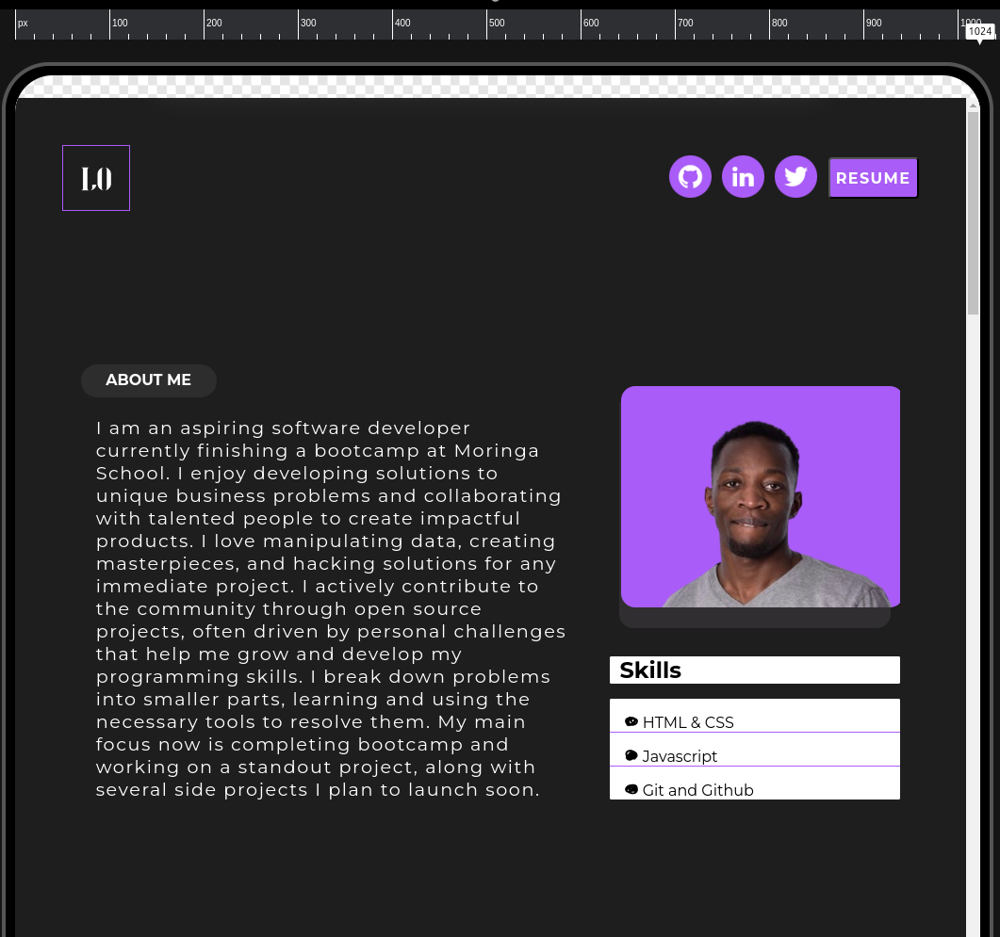
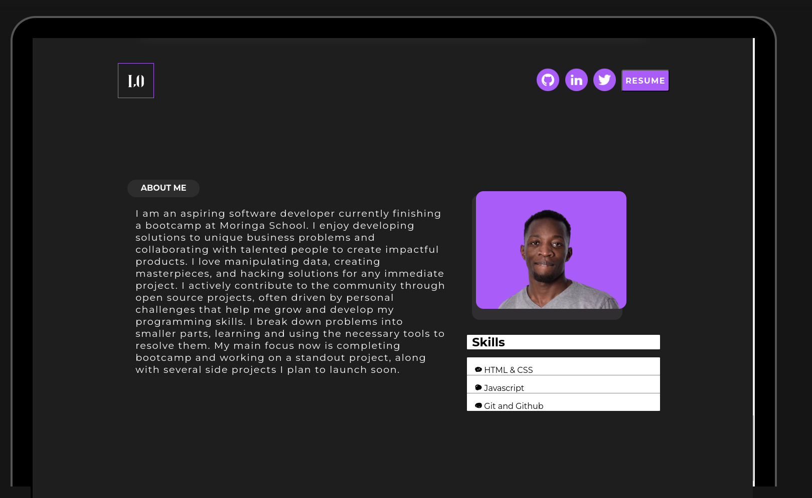
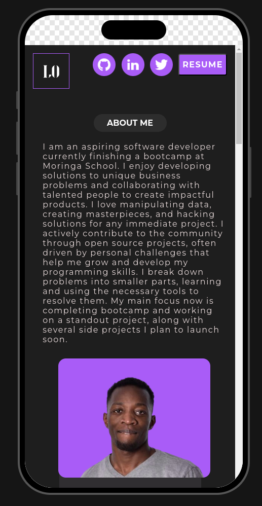

<div align="center">
  
</div>
<h1 align="center">
  Lewis Odero Personal Website
</h1>

<p align="center">
  A portfolio website for <a href="https://levos-snr.github.io/lewisodero-website/" target="_blank">Lewis Odero</a> built with <a href="https://developer.mozilla.org/en-US/docs/Web/HTML" target="_blank">Html</a> , <a href="https://developer.mozilla.org/en-US/docs/Web/CSS" target="_blank">Css</a> and <a href="https://developer.mozilla.org/en-US/docs/Web/JavaScript" target="_blank">Javascript</a>
</p>





---
## 🚨 About this repo (please read!)

The design of this website is inspired by various sources, but I assure you that every piece of code was written from scratch. Unlike other projects, this portfolio was built using unique technologies `like HTML`, `CSS`, `JavaScript`, and `jQuery`. While it may look similar to some designs, the code, functionality, and overall structure are completely original and reflect significant personal effort and innovation.

---
### Table of Contents

- [🚨 About this repo (please read!)](#-about-this-repo-please-read)
  - [Table of Contents](#table-of-contents)
- [Description](#description)
- [Technologies \& tools](#technologies--tools)
  - [How To Use](#how-to-use)
- [🛠 Installation \& Set Up](#-installation--set-up)
- [References](#references)
- [License](#license)
- [SOFTWARE.](#software)
- [Author Info](#author-info)

---

## Description

This portfolio is more than just a static website. It includes dynamic elements and animations powered by jQuery to enhance the user experience. The navigation tabs, smooth scrolling, and interactive bubbles are just a few examples of the custom features implemented to make the site engaging and user-friendly.

---

## Technologies & tools

- Html
- Css
- Javascript
  
---


### How To Use


Yes, you can fork this repo. Please give me proper credit by linking back to [github.com](https://github.com/levos-snr/lewisodero-website.git). Thanks!

## 🛠 Installation & Set Up

1. Clone the repo CLI

   ```sh
   git clone https://github.com/levos-snr/lewisodero-website.git
   ```
2. Change according to your liking
   
3.  Preview the site as it will appear once deployed

4. Push to github
   <br>
  ```sh 
  git add .
  ```
  ```sh
  git commit -m "some message"  
  ``` 
   ```sh
   git push
  ```

5. (OPTIONAL) 
   - Set git pages for hosting
         ```sh
          - Setting -> Pages -> chose root branch(main/master)
         ```
## References

| Color          | Hex                                                                |
| -------------- | ------------------------------------------------------------------ |
| Background color        |  `#0a192f` |
| Primary color     |  `#2d2d2d` |
| Secondary color  |  `#a95cf7` |


---

## License

MIT License

Copyright (c) 2024 Lewis Odero

Permission is hereby granted, free of charge, to any person obtaining a copy
of this software and associated documentation files (the "Software"), to deal
in the Software without restriction, including without limitation the rights
to use, copy, modify, merge, publish, distribute, sublicense, and/or sell
copies of the Software, and to permit persons to whom the Software is
furnished to do so, subject to the following conditions:

The above copyright notice and this permission notice shall be included in all
copies or substantial portions of the Software.

THE SOFTWARE IS PROVIDED "AS IS", WITHOUT WARRANTY OF ANY KIND, EXPRESS OR
IMPLIED, INCLUDING BUT NOT LIMITED TO THE WARRANTIES OF MERCHANTABILITY,
FITNESS FOR A PARTICULAR PURPOSE AND NONINFRINGEMENT. IN NO EVENT SHALL THE
AUTHORS OR COPYRIGHT HOLDERS BE LIABLE FOR ANY CLAIM, DAMAGES OR OTHER
LIABILITY, WHETHER IN AN ACTION OF CONTRACT, TORT OR OTHERWISE, ARISING FROM,
OUT OF OR IN CONNECTION WITH THE SOFTWARE OR THE USE OR OTHER DEALINGS IN THE
SOFTWARE.
---

## Author Info

- Linkedin - [@lewis-odero-developer](https://www.linkedin.com/in/lewis-odero-developer/)
- Website - [Lewis Odero](https://levos-snr.github.io/lewisodero-website/)

[Back To The Top](#description) :

